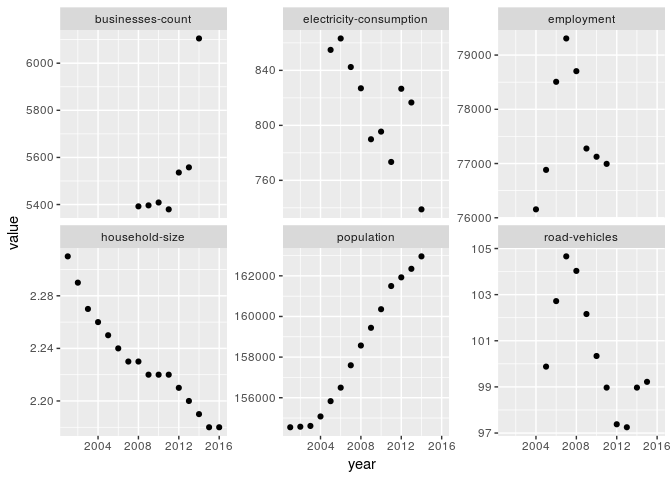
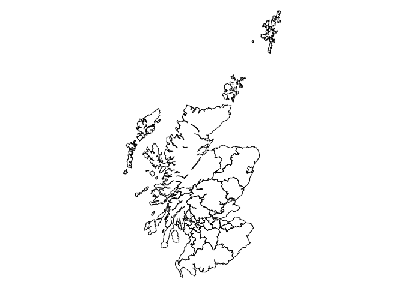

Variable explorer
================
Mike Spencer
5 February 2018

R Markdown
----------

This is an R Markdown document. Markdown is a simple formatting syntax for authoring HTML, PDF, and MS Word documents. For more details on using R Markdown see <http://rmarkdown.rstudio.com>.

Intro
-----

This brief document shows the data for the visualising complexity workshop.

``` r
library(dplyr)
library(ggplot2)
library(rgdal)
```

Data
----

``` r
df = read.csv("../data/prepared/normalised_data.csv")

LAs = readOGR(paste0(normalizePath(".."), "/data/prepared"), "Scot_LAs")
```

    ## OGR data source with driver: ESRI Shapefile 
    ## Source: "/home/michael/repo/visualising-complexity-workshop/data/prepared", layer: "Scot_LAs"
    ## with 32 features
    ## It has 2 fields

### Variables

``` r
df %>% 
   group_by(year, variable) %>% 
   summarise(value=round(mean(value), 2)) %>% 
   ggplot(aes(year, value)) +
   geom_point() +
   facet_wrap(~variable, scales="free_y")
```



### Spatial

``` r
par(mar=c(0, 0, 0, 0))
plot(LAs)
```



``` r
par(mar=c(5, 4, 4, 2) + 0.1)
```
